# Loco3D Docker, User Manual

# Summary

See https://github.com/MeMory-of-MOtion/docker-loco3d for details on the data format and how to use them. 

## Context

HPP-Loco3D is a complete software for planning locomotion movement, including: contact locations and order ; centroidal
trajectory ; contact timings; contact forces ; whole-body movement. HPP-Loco3D is composed of several software
libraries, dispatched in several repositories. They can be mounted as several CORBA servers. Python scripts are
provided to load the robot model, the scene, formulate the planning problem and get the solution.

The Loco3D docker is a packaging-from-binary solution to help a new user to simply set up the planner and generate new plans. It is designed to be used as a black box. The main envisaged context is massive parallel computation on the cloud, using docker-based architecture. The Loco3D docker is used to generated Deliverable D1.1 of H2020 Memory-of-motion project (Memmo).

## Accessing the dataset 

The dataset can be downloaded with the following links : 

# Test scenario description

The following scenarios use the robot ANYmal with various environments and locomotion tasks. 

## `anymal_circle`

In this scenario the goal position is on a circle of 15cm of radius, with the initial position at it's center. The orientation of the robot in the initial and goal state is always facing the x axis, and this orientation is constrained for the whole motion. This mean that the robot may need to walk sideway or backward to reach the goal state, as shown in the following figures and videos.
)

Example with the goal state on the front of the circle, leading to a straight motion.

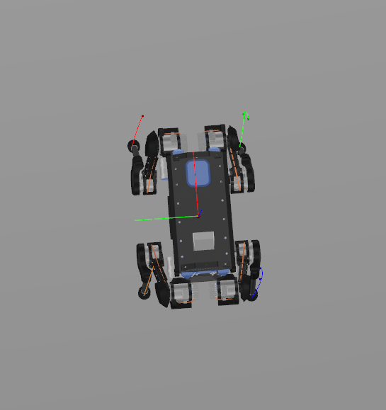

Example with the goal state on the right of the circle, leading to a sideway motion.

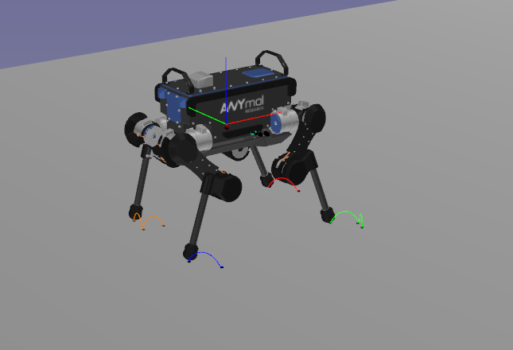
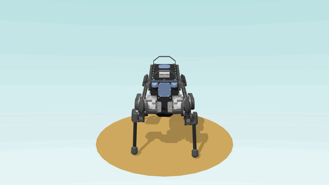

Example with the goal state on the back of the circle, leading to a backward motion.

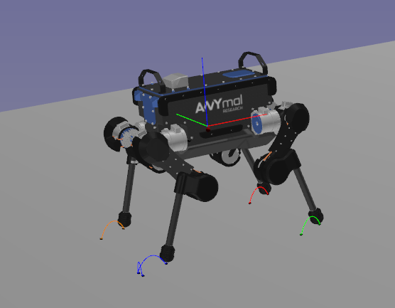

## `anymal_circle_oriented`

In this scenario the goal position is on a circle of 1m of radius, with the initial position at it's center. The initial orientation of the robot always face the x axis, but the goal orientation is in the direction of the circle's radius. The robot will thus operate turns to reach the desired goal position/orientation, as shown in the following figures and videos.

Example with the goal state on the front of the circle, leading to a straight motion.

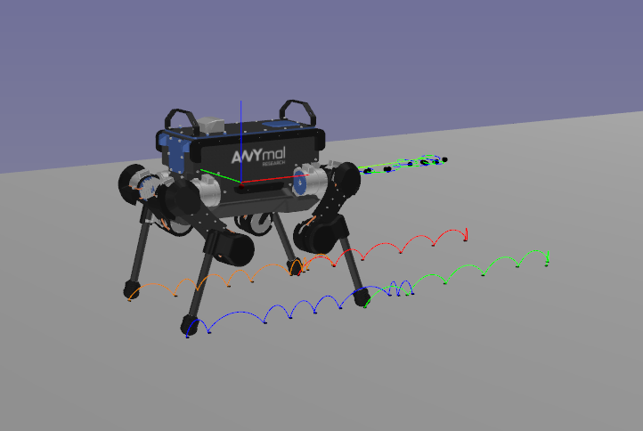

Example with the goal state on the right and back of the circle, leading to a motion beginning with a important turn.

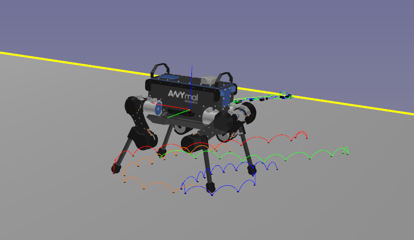

Example with the goal state on the left and front of the circle, leading to a motion with a slight turn.

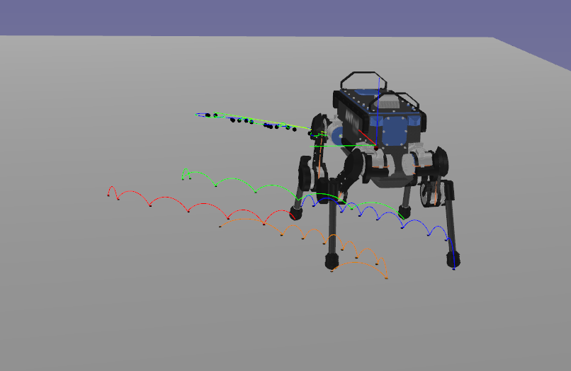

## `anymal_platform_random`

This scenario use an environment composed of rectangular portion of flat floor with lines of inclined patforms in-between. The smaller platform are 30cm long for 20cm width and are inclined of 15 Degree along the x or y axis. You can find the mesh here: https://github.com/pFernbach/hpp-environments/blob/devel/meshes/multicontact/plateforme_not_flat.stl

The initial and goal position are random in the environment, the orientation is such that the initial orientation face the goal position. 

Example with an initial and goal state close, leading to a motion with a few steps. 

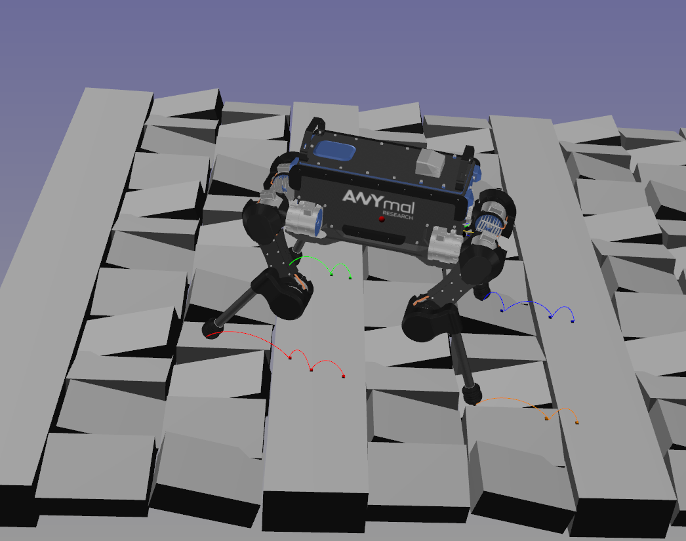
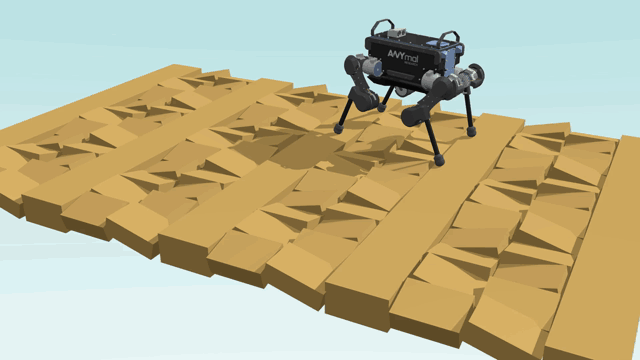

Example with a goal state far from the initial state. 

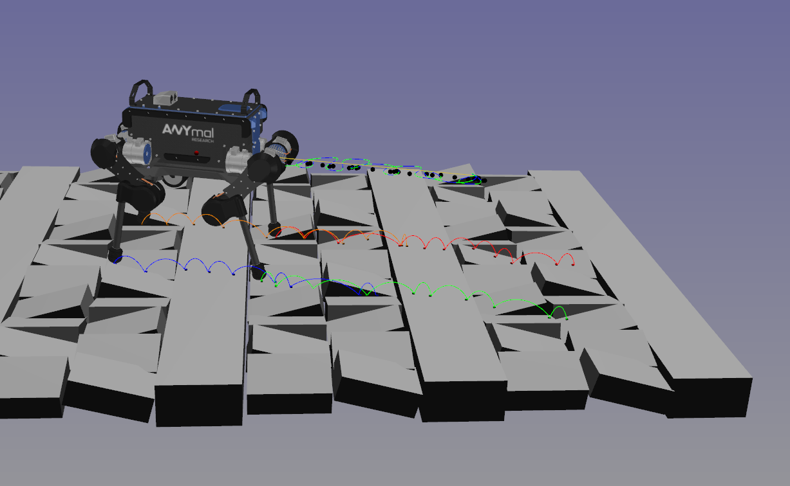

Example with a a motion travesing diagonnaly the environment.

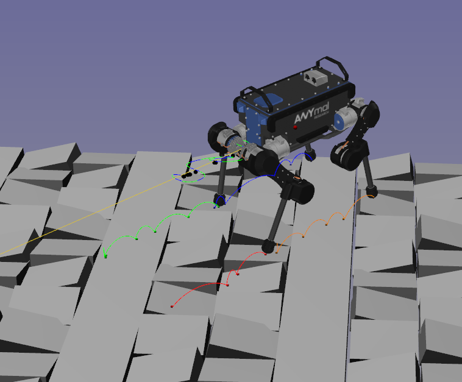

